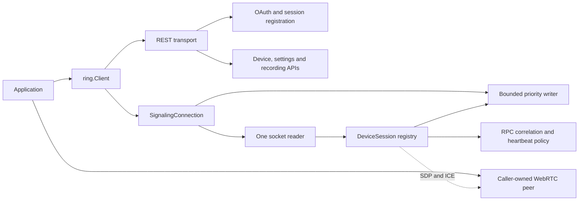

# Architecture and ownership

The public entry point is `pkg/ring`. The Python reference supplies behavior and
test comparisons; Go owns its public API, concurrency, and resource lifecycle.

`Client` owns opened signaling connections and registered legacy RTC handles.
A `SignalingConnection` owns one WebSocket and routes by dialog identity. Its
children own distinct device, signaling-session, and PTZ control-session IDs.
The reader never runs user callbacks or blocks waiting for an application to
consume an event. Each child has a bounded event queue; overflow is observable
as a terminal backpressure error. Application contexts cancel their owned work.
The caller owns and closes the media peer separately.

| Code | Responsibility |
|---|---|
| `pkg/ring` | Public request/result types, client options, device normalization, HTTP methods, connection and session ownership |
| `pkg/ringapimodels` | Existing public device models and typed errors |
| `pkg/dependencies/rest` | Existing auth mechanisms and HTTP request/response adaptation; custom HTTP client support; safe-read retries |
| `pkg/dependencymodels` | Existing wire-facing HTTP models |
| `internal/protocol` | Verified service defaults, endpoint profiles, paths, signaling method and RPC constants |
| `internal/signaling` | SDP validation/normalization, active-session RPC correlation, liveness/expiry and named policy defaults |
| `internal/testkit/replay` | Strict offline HTTP transport and scripted local WebSocket peers |
| `api` | Validated OpenAPI and AsyncAPI contracts; raw captured operations can exist without a public wrapper |
| `test/recordings` | Actual sanitized exchanges, conversations, and schemas |
| `tools/reference-replay`, `tools/protocols`, `tools/capture` | Optional maintainer comparison, validation, and extraction tools |

The existing REST/wire packages remain in place for compatibility. New callers
should depend on `pkg/ring`, not the transport packages. Moving legacy packages
under `internal` is not required to establish tested lifecycle ownership and
would be a separate removal/migration decision.

The pinned Python library uses its Auth object, Ring inventory/cache, family
models, and per-stream WebRTC helper. The Go port shares the behavioral
checklist while separating a persistent signaling connection from each device
session. Python's legacy inventory and FCM event transport are not treated as
proof of v3 discovery or WebSocket push parity. See the
[feature matrix](parity-matrix.md) and [test mapping](porting-progress.md).

Schemas are validated by official document tooling plus actual recorded
payloads. Wire models remain handwritten in this iteration: the captured
HTTP schema intentionally leaves unobserved fields extensible, so generating
a closed DTO for every vendor device would imply more coverage than the
recordings establish. Shared schema validation and runtime-constant consistency
tests are the current drift checks. DTO generation can follow a fuller schema;
it is not a second, conflicting source of wire truth.

No reconnect silently repeats PTZ movement. Mutating HTTP calls are not
transport/server-error retried. An acknowledgement means a command was
accepted, and a lost acknowledgement leaves its outcome unknown. See
[migration](migration.md), [session design](session-design.md), and
[constant ownership](constants-and-configuration.md) for the concrete rules.
