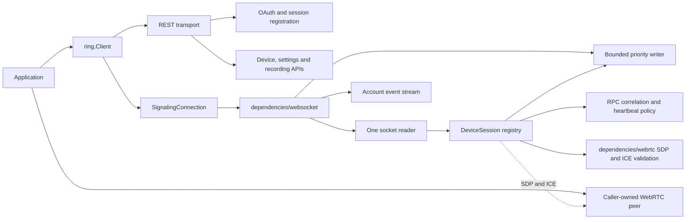

# Architecture and ownership

The public entry point is `pkg/ring`. It owns the client-facing API and the
association between account connections and child sessions. Transport I/O and
media validation live in dependency packages.

`Client` owns reusable transports and opened signaling connections. An
`AuthContext` value is attached to each account-level request and travels
through the REST layer without changing shared client authorization. Login
sessions own their own PKCE state and cookies. A signaling or event connection
keeps the account selected when it opens; its children cannot switch accounts.
A `SignalingConnection` owns one WebSocket and routes by dialog identity. Its
children own distinct device, signaling-session, and PTZ control-session IDs.
The reader never runs user callbacks or blocks waiting for an application to
consume an event. Each child has a bounded event queue; overflow is observable
as a terminal backpressure error. Application contexts cancel their owned work.
The caller owns and closes the media peer separately.

| Code | Responsibility |
|---|---|
| `pkg/ring` | Public request/result types, client options, HTTP methods, session orchestration, and child ownership |
| `pkg/ringapimodels` | OpenAPI-generated public device, auth, event, and recording projections; handwritten behavior and typed errors |
| `pkg/dependencies/rest` | Existing auth mechanisms and HTTP request/response adaptation; custom HTTP client support; safe-read retries |
| `pkg/dependencies/websocket` | Event-stream dial/read/close, signaling dial/read/write deadlines, bounded priority writer, and live-answer negotiation |
| `pkg/dependencies/webrtc` | SDP parsing, answer normalization, and ICE media-identity validation |
| `internal/protocol` | Verified service defaults, endpoint profiles, paths, signaling method and RPC constants |
| `internal/signaling` | Active-session RPC correlation, liveness/expiry and named policy defaults |
| `internal/testkit/replay` | Strict offline HTTP transport and scripted local WebSocket peers |
| `api` | Validated OpenAPI and AsyncAPI contracts; raw captured operations can exist without a public wrapper |
| `tests/replay/fixtures/recordings` | Actual sanitized exchanges, conversations, and schemas |
| `tests/replay` | Public API replay tests against local HTTP/WebSocket peers, with captured and labeled synthetic fixtures |
| `tests/integration` | Opt-in full end-to-end tests against real endpoints and hardware |
| `tools/protocols`, `tools/capture` | Schema validation and recording extraction tools |

New callers should depend on `pkg/ring`, not the transport packages. The
remaining transport scheduling in `pkg/ring` is the push/playback heartbeat
loops. Their public session methods can stay in `ring` while their ticker
mechanics move to `dependencies/websocket` in a further pass. Session-specific
RPC correlation and expiry already live in `internal/signaling`.

The pinned Python library uses its Auth object, Ring inventory/cache, family
models, and per-stream WebRTC helper. The Go port shares the behavioral
checklist while separating a persistent signaling connection from each device
session. Python's legacy inventory and FCM event transport are not treated as
proof of v3 discovery or WebSocket push parity. See the
[feature matrix](parity-matrix.md) and [test mapping](porting-progress.md).

Schemas are validated by official document tooling plus actual recorded
payloads. `api/openapi.yaml` defines captured HTTP operations;
`api/client-models.openapi.yaml` defines the public SDK projection. Both Go
model sets are generated by `make generate-api`. REST returns generated HTTP
models directly; the public client groups devices using schema-generated kind
enums and converts them to its public device types.
Known legacy health fields are typed while unobserved hardware fields remain
extensible. Replay tests check the generated models against recorded bodies.

No reconnect silently repeats PTZ movement. Mutating HTTP calls are not
transport/server-error retried. An acknowledgement means a command was
accepted, and a lost acknowledgement leaves its outcome unknown. See
[migration](../plans/migration.md), [session design](../plans/session-design.md), and
[constant ownership](constants-and-configuration.md) for the concrete rules.
